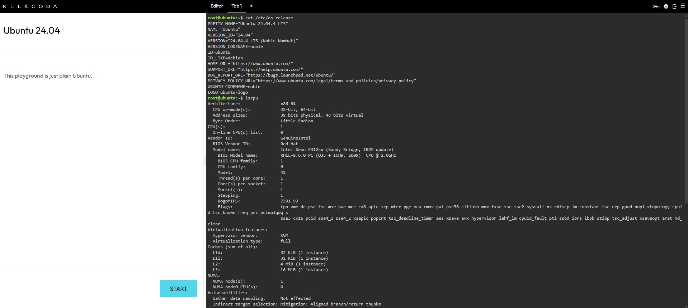
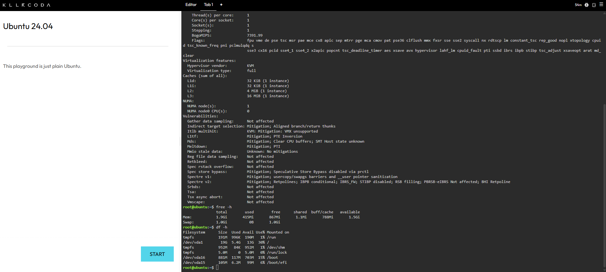

# Laboratory 03: Multi-Cloud Explorer

## Checkpoint 7: Linux Investigation

### Linux System Information
Based on the investigation using the KillerCoda terminal, here are the system details:

- **Operating System:** Ubuntu 24.04.4 LTS (Noble Numbat)
- **CPU Information:** x86_64 | Intel Xeon E312xx (Sandy Bridge) | 1 CPU Core
- **Memory (RAM):** 1.9 Gi Total
- **Disk Space:** 19 G Total (on /dev/vda1)

### Cloud Migration Analysis
If this Linux server were migrated to the cloud, it could be hosted using the following Infrastructure-as-a-Service (IaaS) offerings:
- **AWS:** Amazon EC2 (Elastic Compute Cloud)
- **Azure:** Azure Virtual Machines
- **GCP:** Google Compute Engine

### Terminal Evidence

