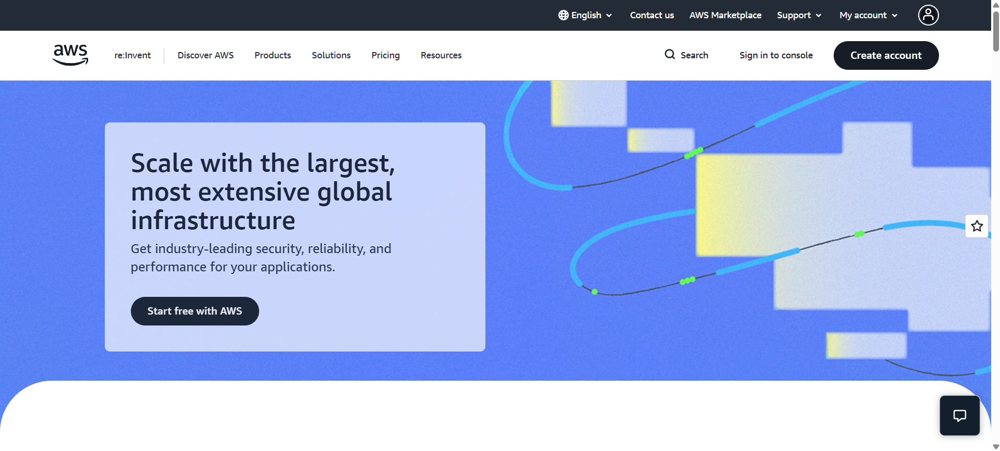

# AWS Research (Amazon Web Services)

### Screenshot of Homepage

### Brief Overview
AWS is the world's most comprehensive cloud platform, offering over 200 services from data centers globally.

### Global Infrastructure
AWS uses Regions and Availability Zones. It currently spans 30+ geographic regions.

### Cloud Management Console
The AWS Management Console is the web interface used to manage all cloud resources.

### Four (4) Core Services
1. Amazon EC2 (Virtual Servers)
2. Amazon S3 (Storage)
3. Amazon RDS (Databases)
4. AWS Lambda (Serverless)

### Three (3) Advantages
1. Most mature platform.
2. Largest community support.
3. High reliability.

### Typical Use Cases
- E-commerce and large-scale web hosting.
