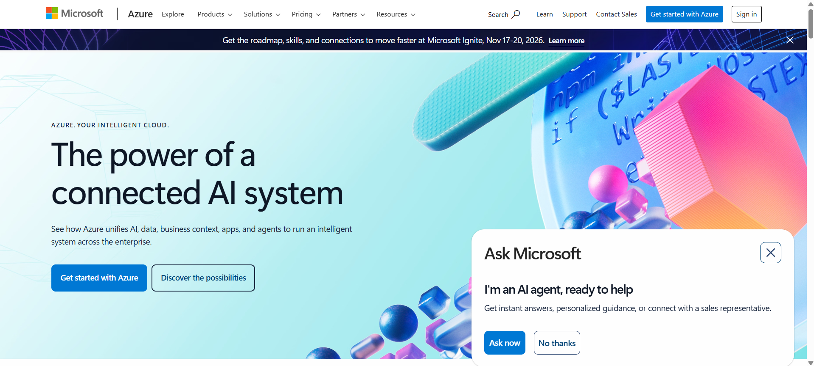

# Microsoft Azure Research

### Screenshot of Homepage

### Brief Overview
Azure is Microsoft's cloud platform, focusing on enterprise solutions and hybrid cloud.

### Global Infrastructure
Azure has more global regions than any other provider, focusing on data residency.

### Cloud Management Console
The Azure Portal is the unified hub for building and managing apps.

### Four (4) Core Services
1. Azure Virtual Machines
2. Azure Blob Storage
3. Azure SQL Database
4. Azure Active Directory

### Three (3) Advantages
1. Best integration with Windows and Office 365.
2. Excellent hybrid cloud support.
3. Cost-effective for existing Microsoft users.

### Typical Use Cases
- Large corporations and government agencies using Microsoft environments.
