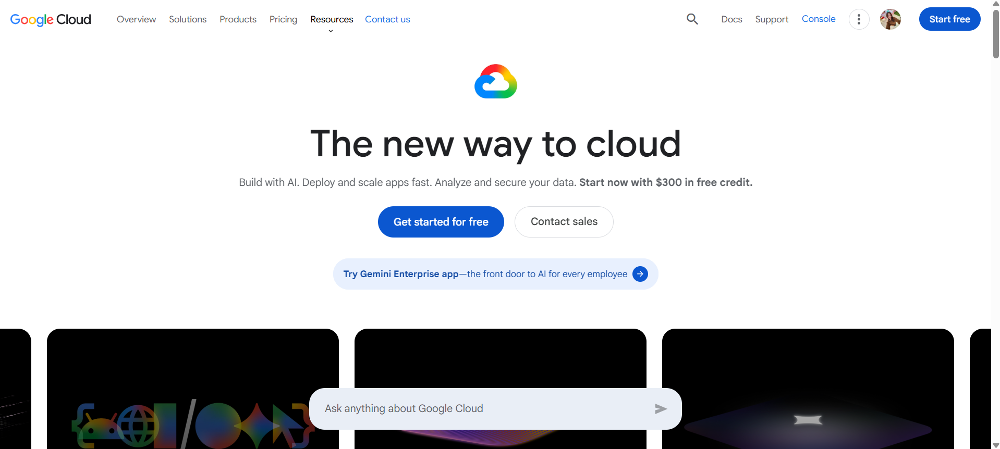

# Google Cloud Platform (GCP) Research

### Screenshot of Homepage

### Brief Overview
GCP specializes in high-end data analytics, machine learning, and containers.

### Global Infrastructure
GCP runs on the same global private network as Google Search and YouTube.

### Cloud Management Console
The Google Cloud Console is known for its clean design and built-in Cloud Shell.

### Four (4) Core Services
1. Google Compute Engine
2. Google Cloud Storage
3. Google Kubernetes Engine (GKE)
4. BigQuery (Data Warehouse)

### Three (3) Advantages
1. Leader in AI and Machine Learning.
2. Expert in Kubernetes and containers.
3. Cost-effective pricing models.

### Typical Use Cases
- AI research, Big Data, and tech startups.
